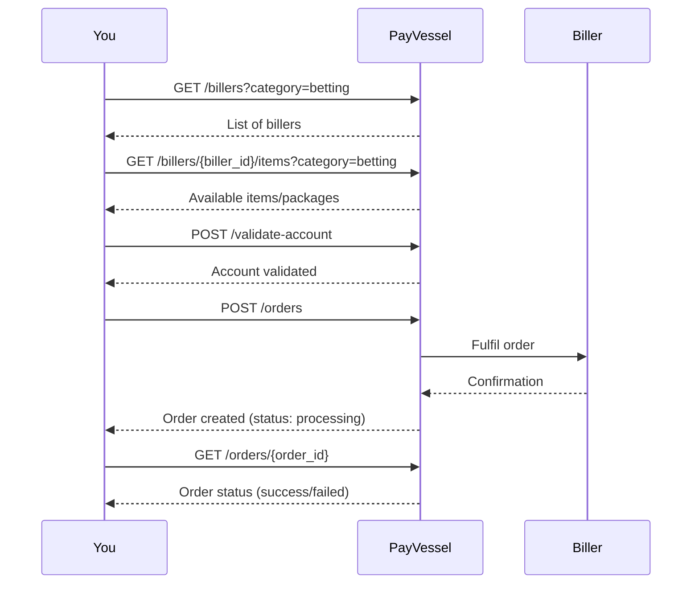

The PayVessel **biller reseller API** lets you resell **airtime**, **data bundles**, and **betting top-ups** to your end users. Orders are charged against your business wallet, and fulfillment is handled by PayVessel.

## Supported categories

| Category | Description |
| --- | --- |
| `airtime` | Prepaid mobile airtime credit |
| `data` | Mobile data bundles |
| `betting` | Betting account funding (e.g. Bet9ja, SportyBet) |

## Integration flow

1. **List billers** for a category to show available providers (e.g. Bet9ja, SportyBet).
2. **List biller items** to get the specific packages or denominations for that biller.
3. **Validate the recharge account** to confirm the customer's account exists before placing an order.
4. **Create an order** to purchase the item; PayVessel debits your wallet and fulfils the request.
5. **Get order** to check the status or poll for completion.



## Order statuses

| Status | Description |
| --- | --- |
| `pending` | Order received, not yet submitted to provider |
| `processing` | Submitted to provider, awaiting confirmation |
| `success` | Fulfilled successfully |
| `failed` | Provider rejected or could not fulfil the order |
| `cancelled` | Order was cancelled |

## Base path

All biller reseller endpoints are under:

```
/api/v1/biller-reseller
```

## Authentication

All requests require `api-key` and `api-secret` headers. See [Authentication](/api-basics/authentication) for details.
