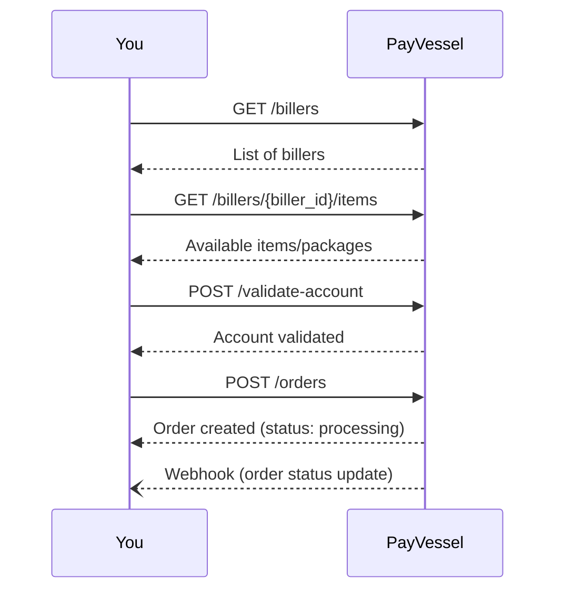

The PayVessel **biller reseller API** lets you resell **airtime**, **data bundles**, and **betting top-ups** to your end users. Orders are charged against your business wallet, and fulfillment is handled by PayVessel.

## Supported categories

| Category | Description |
| --- | --- |
| `airtime` | Prepaid mobile airtime credit |
| `data` | Mobile data bundles |
| `betting` | Betting account funding (e.g. Bet9ja, SportyBet) |

## Integration flow

1. **List billers** to show available providers (e.g. Bet9ja, SportyBet).
2. **List biller items** to get the specific packages or denominations for that biller.
3. **Validate the recharge account** to confirm the customer's account exists before placing an order.
4. **Create an order** to purchase the item; PayVessel debits your wallet and fulfils the request.
5. **Receive a webhook** when the order status changes (e.g. success, failed).
6. **Verify order** or **get order** to check the status or retrieve order details.



## Order statuses

| Status | Description |
| --- | --- |
| `pending` | Order received, not yet being processed |
| `processing` | Order is being fulfilled |
| `success` | Fulfilled successfully |
| `failed` | Order could not be fulfilled |
| `cancelled` | Order was cancelled |

## Base path

All biller reseller endpoints are under:

```
/vaas/api/v1/biller-reseller
```

## Sandbox testing

In sandbox mode, only the following recharge accounts are accepted during [account validation](/biller-reseller/validate-account):

| Recharge Account | Account Name |
| --- | --- |
| `1234567890` | John Doe |
| `0987654321` | Jane Smith |
| `1111111111` | Test User One |
| `2222222222` | Test User Two |
| `3333333333` | Test User Three |

Use any of these accounts when testing the validate-account and create-order endpoints.

Your sandbox wallet has a fixed balance of **NGN 10,000**. Orders are validated against this amount but debits are not tracked, so the balance never decreases.

## Authentication

All requests require `api-key` and `api-secret` headers. See [Authentication](/api-basics/authentication) for details.
