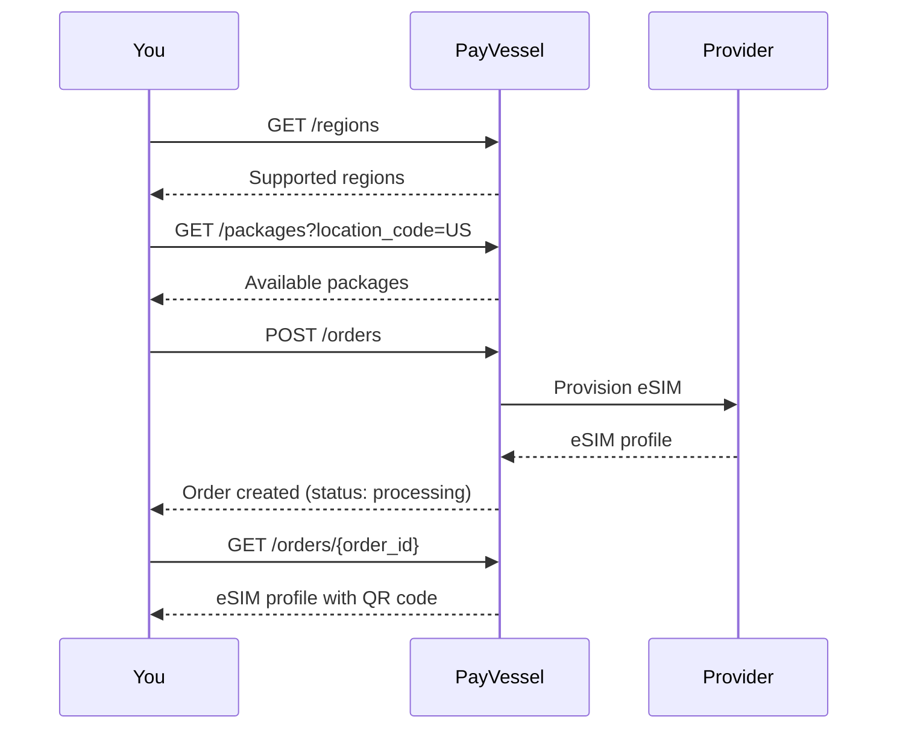

The PayVessel **eSIM API** lets you sell **eSIM data packages** to your users for international travel. Browse available regions and packages, create orders, and deliver eSIM profiles with QR codes for instant activation.

## Integration flow

1. **List regions** to discover supported countries and areas.
2. **List packages** with optional filters (location, type) to find data plans.
3. **Create an order** for a package; PayVessel debits your wallet and provisions the eSIM.
4. **Get order** to retrieve the eSIM profile details (QR code, ICCID, activation instructions).



## Order statuses

| Status | Description |
| --- | --- |
| `pending` | Order received, not yet submitted to provider |
| `processing` | Submitted to provider, awaiting provisioning |
| `completed` | eSIM provisioned; profile details available |
| `failed` | Provider could not provision the eSIM |

## Base path

All eSIM endpoints are under:

```
/vaas/api/v1/esim
```

## Authentication

All requests require `api-key` and `api-secret` headers. See [Authentication](/api-basics/authentication) for details.
