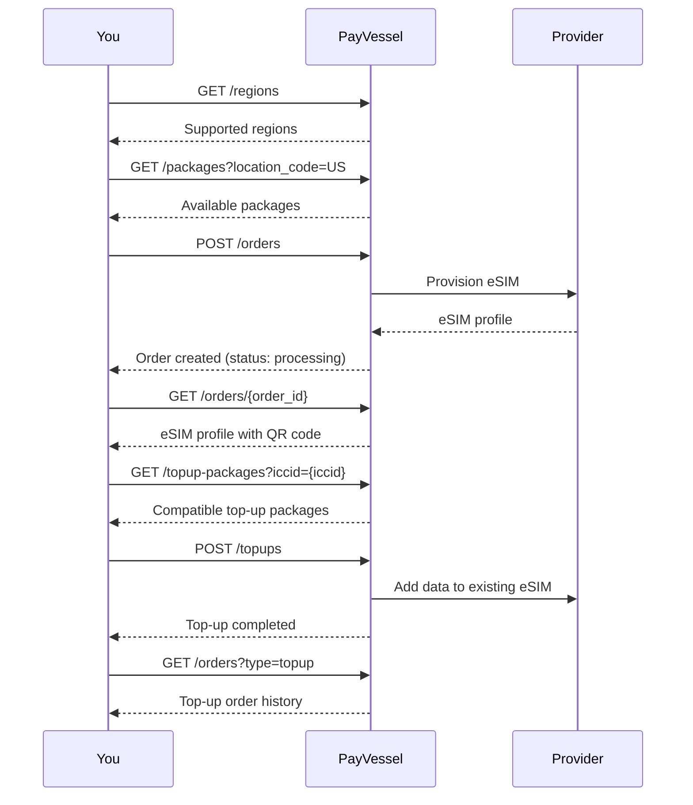

The PayVessel **eSIM API** lets you sell **eSIM data packages** to your users for international travel. Browse available regions and base packages, provision eSIM profiles, and top up eligible profiles with compatible data packages.

## Integration flow

1. **List regions** to discover supported countries and areas.
2. **List base packages** to find a data plan for a new eSIM profile.
3. **Create an order** for a package; PayVessel debits your wallet and provisions the eSIM.
4. **Get order** to retrieve the eSIM profile details (QR code, ICCID, activation instructions).
5. **List top-up packages** for an issued profile, then create a top-up using its ICCID or eSIM transaction number.
6. **List orders** with `type=purchase` or `type=topup` to retrieve transaction history.


```mermaid
sequenceDiagram
    participant You
    participant PayVessel
    participant Provider

    You->>PayVessel: GET /regions
    PayVessel-->>You: Supported regions
    You->>PayVessel: GET /packages?location_code=US
    PayVessel-->>You: Available packages
    You->>PayVessel: POST /orders
    PayVessel->>Provider: Provision eSIM
    Provider-->>PayVessel: eSIM profile
    PayVessel-->>You: Order created (status: processing)
    You->>PayVessel: GET /orders/{order_id}
    PayVessel-->>You: eSIM profile with QR code
    You->>PayVessel: GET /topup-packages?iccid={iccid}
    PayVessel-->>You: Compatible top-up packages
    You->>PayVessel: POST /topups
    PayVessel->>Provider: Add data to existing eSIM
    PayVessel-->>You: Top-up completed
    You->>PayVessel: GET /orders?type=topup
    PayVessel-->>You: Top-up order history
```

## Order statuses

| Status | Description |
| --- | --- |
| `pending` | Order received, not yet submitted to provider |
| `processing` | Submitted to provider, awaiting provisioning |
| `success` | eSIM provisioned; profile details available |
| `failed` | Provider could not provision the eSIM |

## Base path

All eSIM endpoints are under:

```
/vaas/api/v1/esim
```

## Authentication

All requests require `api-key` and `api-secret` headers. See [Authentication](/api-basics/authentication) for details.
