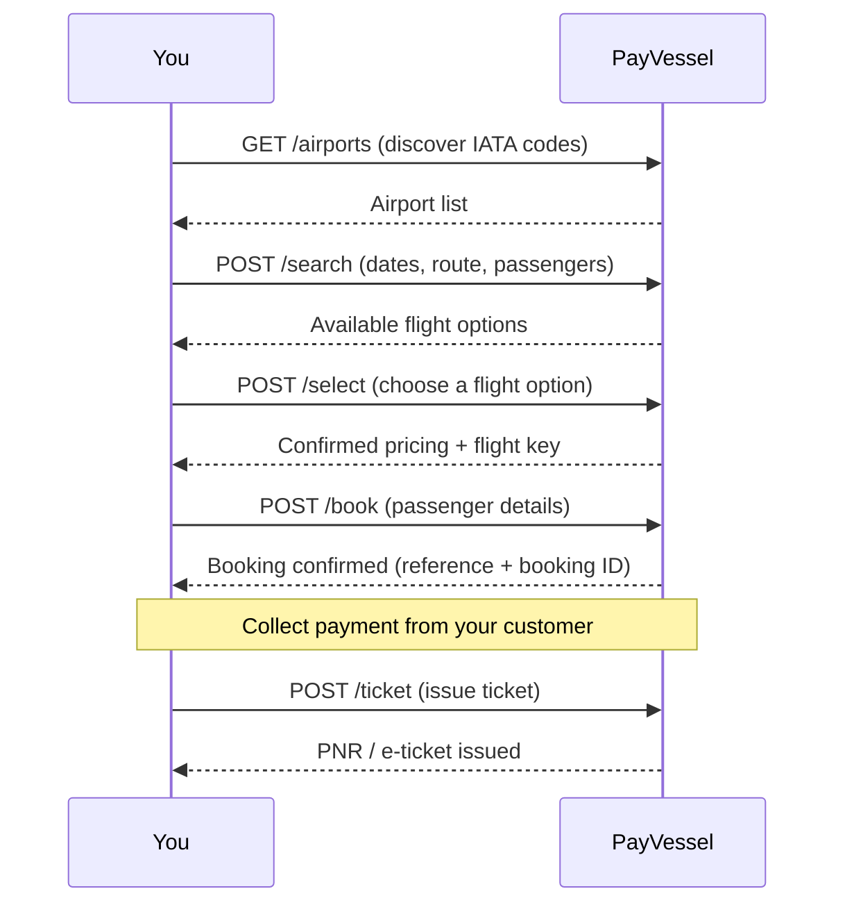

The PayVessel **Flight Booking API** lets you search, price, and book flights for your customers across domestic and international routes. Once a booking is confirmed, PayVessel debits your business wallet and issues the airline ticket directly via the API — you receive a **PNR** (Passenger Name Record) confirmation to share with the traveller.

## Access

Flight Booking is a **gated product**. To request access to this service, contact [support@payvessel.com](mailto:support@payvessel.com). Once enabled, authenticate every request with your **API key** and **API secret**.

## Integration flow

## Booking statuses

| Status | Description |
| --- | --- |
| `PENDING` | Booking request received, not yet confirmed |
| `BOOKED` | Booking confirmed with the airline, awaiting ticketing |
| `TICKETED` | Ticket issued; PNR available |
| `FAILED` | Booking or ticketing failed |
| `CANCELLED` | Booking was cancelled |

## Trip types

| `tripType` | Description |
| --- | --- |
| `OneWay` | Single leg, one direction |
| `Return` | Outbound + return on the same route |
| `MultiDestination` | Multiple legs with different origins/destinations |

## Cabin classes

| `cabinClass` | Description |
| --- | --- |
| `Economy` | Standard economy class |
| `Business` | Business class |
| `FirstClass` | First class |

<CardGroup cols={2}>
  <Card title="Get Airports" icon="location-dot" href="/flight/airports">
    Discover IATA airport codes
  </Card>
  <Card title="Search Flights" icon="magnifying-glass" href="/flight/search-flights">
    Find available flights by route and date
  </Card>
  <Card title="Book a Flight" icon="ticket-airline" href="/flight/book-flight">
    Confirm seats with passenger details
  </Card>
  <Card title="Issue Ticket" icon="paper-plane" href="/flight/ticket-flight">
    Get the PNR after payment
  </Card>
</CardGroup>

---
