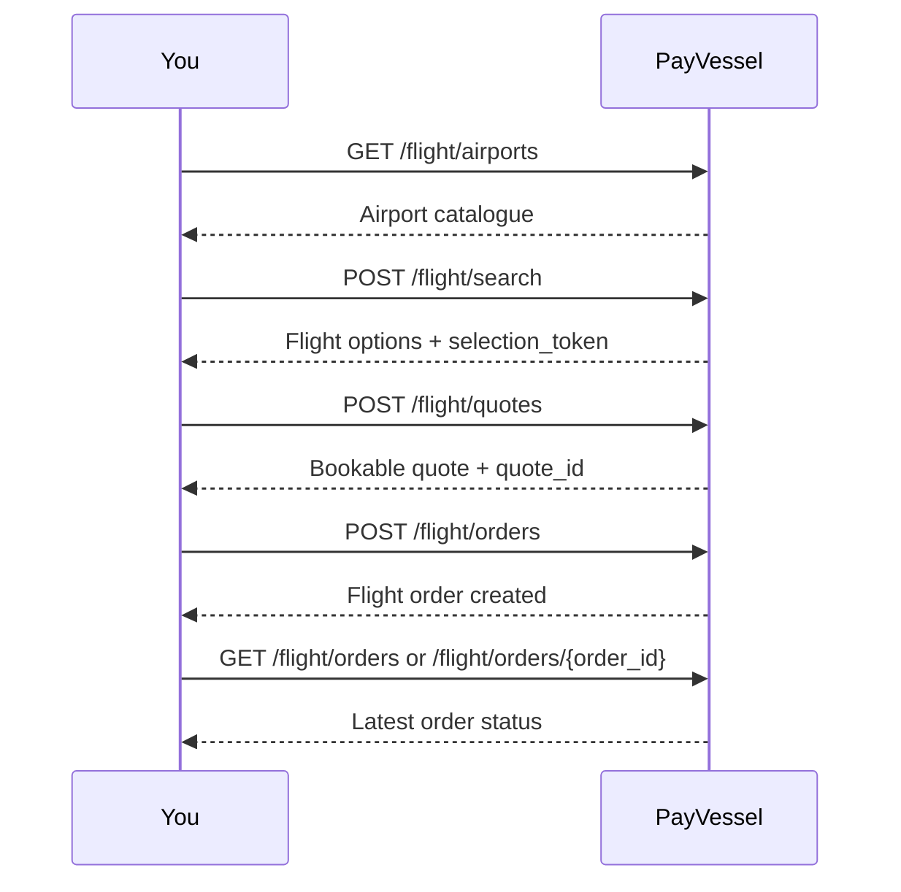

The PayVessel **flight API** lets you search airports, retrieve available flight options, create a bookable quote, and place flight orders through a single VaaS integration.

Search responses return **preview pricing**. Before creating an order, create a quote to confirm the final payable amount and receive a time-bound `quote_id`.

## Integration flow

1. **List airports** to retrieve supported airport codes.
2. **Search flights** to retrieve available options and an opaque `selection_token`.
3. **Create quote** to validate the selected option and receive a `quote_id`.
4. **Create order** to charge your wallet and submit the booking.
5. **List orders** or **get order** to track the latest booking status.


```mermaid
sequenceDiagram
    participant You
    participant PayVessel

    You->>PayVessel: GET /flight/airports
    PayVessel-->>You: Airport catalogue

    You->>PayVessel: POST /flight/search
    PayVessel-->>You: Flight options + selection_token

    You->>PayVessel: POST /flight/quotes
    PayVessel-->>You: Bookable quote + quote_id

    You->>PayVessel: POST /flight/orders
    PayVessel-->>You: Flight order created

    You->>PayVessel: GET /flight/orders or /flight/orders/{order_id}
    PayVessel-->>You: Latest order status
```

## Base path

All flight endpoints are under:

```text
/vaas/api/v1/flight
```

## Authentication

All requests require `api-key` and `api-secret` headers. See [Authentication](/api-basics/authentication) for details.

## Search types

| `search_type` | Description |
| --- | --- |
| `oneway` | One itinerary only |
| `return` | Exactly two itineraries, outbound and return |
| `multidestination` | Two or more itineraries |

## Cabin classes

| `cabin_class` | Description |
| --- | --- |
| `economy` | Standard economy |
| `premium_economy` | Premium economy |
| `business` | Business class |
| `first` | First class |

## Quote statuses

| Status | Description |
| --- | --- |
| `active` | Quote is valid and can be used to create an order |
| `consumed` | Quote has already been used to create an order |
| `expired` | Quote validity window has elapsed |
| `cancelled` | Quote is no longer usable |

## Order statuses

| Status | Description |
| --- | --- |
| `pending` | Order has been created and is awaiting downstream processing |
| `processing` | Booking is in progress |
| `completed` | Booking completed successfully |
| `failed` | Booking could not be completed |
| `cancelled` | Order was cancelled |

## Pricing fields

| Field | Meaning |
| --- | --- |
| `base_price` | Merchant-facing fare before service charge |
| `service_charge` | Additional service fee charged on the booking |
| `total_amount` | Total amount payable by the merchant |
| `wallet_reward_on_success` | Amount scheduled to be credited back after a successful booking |
| `price_status` | `preview` during search, `final` after quote creation |

<CardGroup cols={2}>
  <Card title="List Airports" icon="location-dot" href="/flight/airports">
    Retrieve supported airport codes
  </Card>
  <Card title="Search Flights" icon="magnifying-glass" href="/flight/search-flights">
    Retrieve flight options and preview pricing
  </Card>
  <Card title="Create Quote" icon="receipt" href="/flight/create-quote">
    Confirm a selected option and receive a quote ID
  </Card>
  <Card title="Create Order" icon="ticket-airline" href="/flight/create-order">
    Charge the wallet and place a booking
  </Card>
  <Card title="List Orders" icon="list" href="/flight/list-orders">
    Retrieve all orders for your business
  </Card>
  <Card title="Get Order" icon="circle-info" href="/flight/get-order">
    Retrieve one order by ID
  </Card>
</CardGroup>
