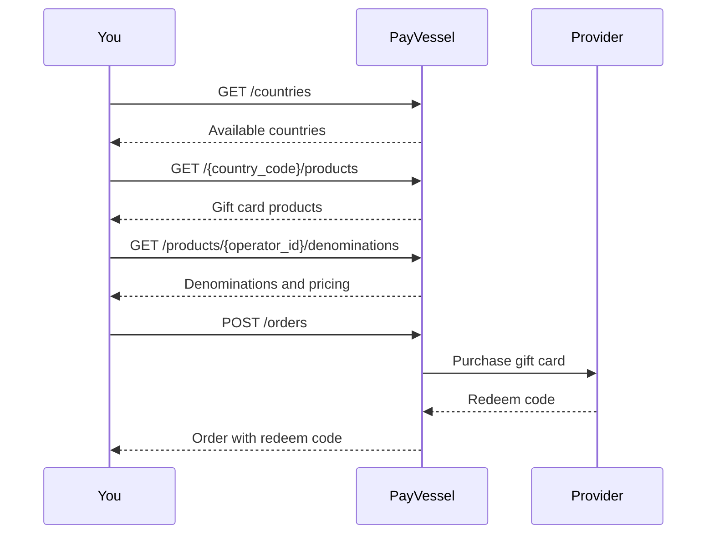

The PayVessel **gift card API** lets you sell **digital gift cards** from global brands to your users. Browse available products by country, check denominations and pricing, and purchase cards instantly.

## Integration flow

1. **List countries** to discover which countries have gift card products.
2. **List products** for a country to show available gift card brands.
3. **Get denominations** for a product to see available values and pricing.
4. **Purchase a gift card** by creating an order; PayVessel debits your wallet and returns the redemption code.
5. **Get order** to retrieve the gift card details (redeem code, serial number).



## Order statuses

| Status | Description |
| --- | --- |
| `pending` | Order received, not yet submitted to provider |
| `processing` | Submitted to provider, awaiting fulfillment |
| `completed` | Gift card purchased; redeem code available |
| `cancelled` | Order was cancelled |

## Base path

All gift card endpoints are under:

```
/api/v1/gift-cards
```

## Authentication

All requests require `api-key` and `api-secret` headers. See [Authentication](/api-basics/authentication) for details.
