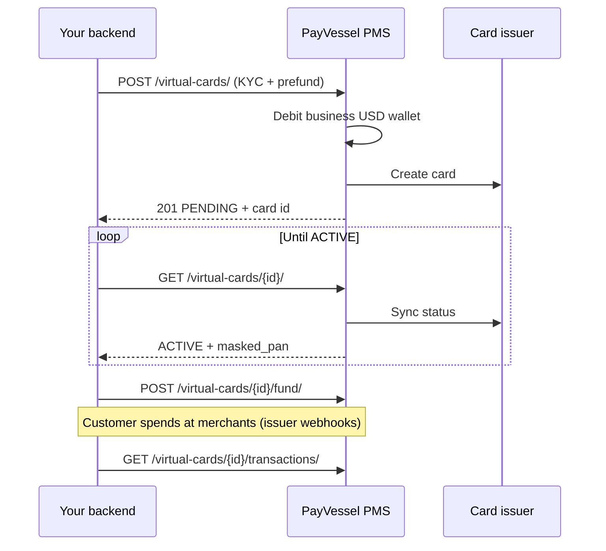

PayVessel **USD virtual cards** let your customers pay online at international merchants. You integrate through the **external API** using your business **API key** and **secret**; PayVessel handles issuer enrollment, card lifecycle, and wallet debits for funding.

Use the **API reference** pages for each endpoint — they include a **Try it** playground (same pattern as [Virtual Accounts](/api-reference/virtual-accounts/create-virtual-account)), with `api-key` and `api-secret` headers and sandbox/production server selection.

<CardGroup cols={2}>
  <Card title="Create a Card" icon="plus" href="/virtual-cards/create-customer-card">
    Issue with KYC and prefund
  </Card>
  <Card title="Get all Cards" icon="list" href="/virtual-cards/list-cards">
    List cards and status
  </Card>
  <Card title="Fund a Card" icon="wallet" href="/virtual-cards/fund-card">
    Load USD from business wallet
  </Card>
  <Card title="Card Fee Quote" icon="receipt" href="/virtual-cards/fee-quote">
    Calculate fees before create or fund
  </Card>
</CardGroup>

***

## Merchant dashboard card details

Issue cards from **Card issuing** in the merchant dashboard (**Create business card** or **Create customer card**, when enabled for your business). After a card is created, open it from the cards list to view **Card details**:


| Area | What you can do |
|------|-----------------|
| **Balance** | View the card’s spendable USD balance synced from the issuer |
| **Fund card / Withdraw** | Move USD between your business USD wallet and the card ([Fund](/virtual-cards/fund-card) / [Withdraw](/virtual-cards/withdraw-card) via API) |
| **Card preview** | Masked PAN, card name, and network (Visa or Mastercard) |
| **Show details** | Reveal full card number, CVV, and expiry when the card is `ACTIVE` |
| **Freeze card** | Temporarily block spend ([Freeze](/virtual-cards/freeze-card) / [Unfreeze](/virtual-cards/unfreeze-card) via API) |
| **Terminate card** | Close the card and return remaining balance to your wallet ([Terminate](/virtual-cards/terminate-card)) |
| **Transactions** | Prefund, spend, withdrawal, and fee entries (e.g. **Card prefund** credits on creation) |
| **Generate card statement** | Export activity for reconciliation |

<Note>
**Customer card access** must be enabled by PayVessel for your business before **Create customer card** appears in the dashboard. Business cards can always be issued from the dashboard. Use the [external API](/virtual-cards/create-customer-card) for programmatic customer card issuance.
</Note>

***

## Base URL

All virtual card endpoints live under:

```
/pms/api/external/request/virtual-cards/
```

| Environment | Base URL |
|-------------|----------|
| Production | `https://api.payvessel.com` |
| Sandbox | `https://sandbox.payvessel.com` |

Example: `POST https://api.payvessel.com/pms/api/external/request/virtual-cards/`

<Note>
Authentication matches other PayVessel external APIs. See [Authentication](/api-basics/authentication) for `api-key` and `api-secret` headers.
</Note>

***

## What you can do (external API)

| Capability | Description |
|------------|-------------|
| **Create customer card** | Enroll or upgrade customer KYC, issue a USD virtual card, prefund from your business USD wallet |
| **List / get card** | Track `PENDING` → `ACTIVE`, masked PAN, issuer balance |
| **Fund card** | Debit business USD wallet; credit card balance at issuer |
| **Withdraw** | Move USD from card back to business wallet (minimum $3) |
| **Freeze / unfreeze** | Temporarily block or restore card spend |
| **Terminate** | Close card; remaining balance returns to business wallet (minus fees) |
| **Transactions** | Card spend, funding, and withdrawal history |
| **Simulate transaction** | Sandbox-only test spend/credit at the issuer |
| **Fee quotes** | Calculate charges before create, fund, or withdraw |

<Warning>
**Customer cards only.** Business (merchant) cards are created from the PayVessel merchant dashboard, not the external API.
</Warning>

***

## Integration flow



<Steps>
  <Step title="Quote creation cost">
    Use [Card Fee Quote](/virtual-cards/fee-quote) to show issuance and funding charges before debiting the wallet.
  </Step>
  <Step title="Create the card">
    Call [Create a Card](/virtual-cards/create-customer-card) with customer KYC. Optionally include `prefund_amount` (minimum **$3 USD** when provided).
  </Step>
  <Step title="Wait for activation">
    New cards return `status: PENDING`. Poll [Get a Card](/virtual-cards/get-card) until `ACTIVE` and `card_number` is present (usually seconds; allow up to a few minutes).
  </Step>
  <Step title="Fund or let customer spend">
    Use [Fund a Card](/virtual-cards/fund-card) for top-ups. Card spends are handled by the issuer; use [Get Card Transactions](/virtual-cards/list-transactions) for history.
  </Step>
  <Step title="Withdraw or terminate">
    Use [Withdraw from a Card](/virtual-cards/withdraw-card) to return USD to your wallet, or [Terminate Card](/virtual-cards/terminate-card) to close the card.
  </Step>
</Steps>

***

## Customer KYC (external API)

The external API requires **full Nigerian KYC on every create request**. `customer_id` is not accepted — existing customers are matched by **email**.

| Field | Required | Notes |
|-------|----------|-------|
| `first_name`, `last_name` | Yes | Customer legal name |
| `email`, `phone` | Yes | Nigerian phone format |
| `bvn`, `nin` | Yes | 11 digits |
| `dob` | Yes | `YYYY-MM-DD` |
| `image` | Yes | Base64 identity image |
| `state`, `lga`, `street`, `postal_code` | Yes | Address |
| `brand`, `currency` | Yes | USD only |
| `prefund_amount` | No | Optional; minimum **$3 USD** when provided |

See [Create a Card](/virtual-cards/create-customer-card) and [KYC overview](/kyc/overview).

***

## Money movement

<AccordionGroup>
  <Accordion title="Business USD wallet ↔ card">
    **Fund** and **create-time prefund** debit your PayVessel **business USD wallet** (managed wallet). **Withdraw** and **terminate** credit it back (withdrawal fee may apply).
  </Accordion>
  <Accordion title="Card balance">
    The **issuer** holds the spendable card balance. PayVessel syncs `balance` on the card object from the issuer after fund, withdraw, and issuer events. Do not assume your local ledger equals issuer balance without calling **Get card**.
  </Accordion>
  <Accordion title="Card spend">
    Merchant charges (AUTHORIZATION, SETTLEMENT, etc.) reduce **card balance only**. They do not debit your business wallet. Query **transactions** for spend history.
  </Accordion>
</AccordionGroup>

***

## Card statuses

| Status | Meaning |
|--------|---------|
| `PENDING` | Issuer is creating the card; no PAN yet |
| `ACTIVE` | Card can be funded and used |
| `FROZEN` | Spend blocked; fund/withdraw may still be restricted |
| `TERMINATED` | Closed; balance settled to wallet |
| `FAILED` | Issuer rejected creation |

***

## Fees

Use [Card Fee Quote](/virtual-cards/fee-quote) to calculate fees for a given operation (`issuance`, `funding`, `withdrawal`, `spend`, etc.) before debiting your wallet.

Funding fee tiers:

- Below tier threshold: flat fee in USD
- At or above tier: percentage of fund amount

***

## Error handling

| HTTP | Typical cause |
|------|----------------|
| `401` | Missing or invalid `api-key` / `api-secret` |
| `400` | Validation (KYC, minimum amounts, insufficient wallet balance) |
| `404` | Unknown `card_id` for your business |
| `429` | External API rate limit |

Responses use `{ "status": true|false, "message": "...", "data": ... }`. Validation errors may include a `errors` object.

***

## Best practices

<CardGroup cols={2}>
  <Card title="Poll activation" icon="rotate">
    After create, poll **Get card** until `ACTIVE` before showing PAN-dependent UI.
  </Card>
  <Card title="Quote before debit" icon="calculator">
    Always show fee quotes before charging your user.
  </Card>
  <Card title="Idempotent UX" icon="fingerprint">
    Store PayVessel `card_id` and transaction `id` for support — issuer references are not exposed in API responses.
  </Card>
  <Card title="Server-side only" icon="server">
    Never call the external API from mobile or browser; keep secrets on your backend.
  </Card>
</CardGroup>

***

## Guides and API reference

Conceptual guides (how it works, use cases) live under **Guides → Issuing**. Technical schemas, **Try it**, and cURL samples live under **API reference → Issuing**.

<CardGroup cols={3}>
  <Card title="Create a Card" icon="plus" href="/virtual-cards/create-customer-card">
    Guide
  </Card>
  <Card title="Create a Card" icon="code" href="/api-reference/virtual-cards/create-customer-card">
    API reference
  </Card>
  <Card title="Get a Card" icon="code" href="/api-reference/virtual-cards/get-card">
    API reference
  </Card>
</CardGroup>
